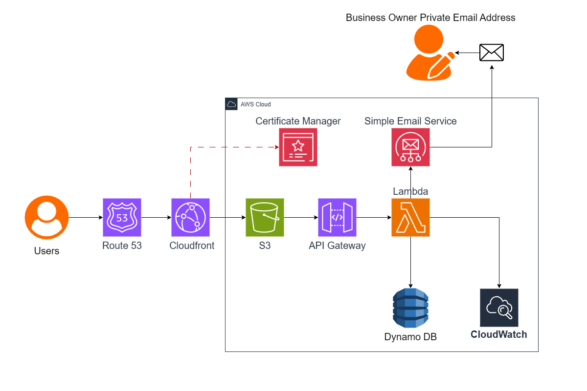

# Serverless Lead Capture on AWS: The Epic Books

## 1. Project Overview
Epic Books is a mock company that needed a simple way to collect customer names and email addresses through their website. Traditional setups rely on fixed servers that are expensive to maintain, slow for global users, and prone to crashes under traffic spikes. Manual patching also introduces security risks.

To solve this, I built a **serverless solution on AWS**, which scales automatically with visitors, reduces infrastructure costs, and improves security using managed AWS services.

---

## 2. Business Requirements
Epic Books required:

- Static website built with HTML, CSS, and JavaScript  
- Customers can download an ebook  
- Customers receive an email notification after download  
- Customer details (name & email) stored in a database  
- Fast and responsive website for global users  
- Support 500 active users with 10–15 daily downloads  
- All traffic must use HTTPS  
- Domain: theepicbooks.com  

---

## 3. Well-Architected Framework Considerations
The solution was designed using the **AWS Well-Architected Framework**, focusing on pillars most relevant to the business:

- **Security:** HTTPS, secure storage of customer data  
- **Performance Efficiency:** Global website performance  
- **Operational Excellence:** Email notifications and monitoring  
- **Cost Optimization:** Serverless components to reduce idle costs  
- **Reliability:** Database durability and automated scaling  

**Prioritized pillars for design decisions:**  
1. Security  
2. Cost Optimization  
3. Performance Efficiency  

These pillars guided architecture choices such as using serverless services, enabling HTTPS, and automating scaling.

---

## 4. Architecture Overview

### 4.1 Architecture Diagram
 

### 4.2 How It Works (Summary)
- Static website hosted on **Amazon S3**  
- Distributed globally via **Amazon CloudFront**  
- HTTPS provided by **AWS Certificate Manager**  
- Form submissions sent to **Amazon API Gateway**  
- Processed by **AWS Lambda**  
- Leads stored in **Amazon DynamoDB**  
- Confirmation emails sent via **Amazon SES**  
- **Amazon CloudWatch** monitors and logs all backend activity  
- **IAM Roles & Policies** enforce least-privilege access  

---

## 5. Design Decisions & Implementation

### 5.1 Hosting Static Website
**Solution:** Amazon S3 + Amazon CloudFront + AWS Certificate Manager  

**Why:**  
- Amazon S3 provides scalable, highly available static hosting  
- Amazon CloudFront improves speed and enables HTTPS  
- AWS Certificate Manager ensures secure connections  

**Implementation Steps:**  
1. Prepare website files (HTML, CSS, JS, images)  
2. Create S3 bucket and enable static website hosting  
3. Configure bucket policies for public access with GetObject permission  
4. Upload all website files and error document  
5. Create Amazon CloudFront distribution with S3 bucket as origin  
6. Request TLS certificate in AWS Certificate Manager  
7. Route domain traffic using **Amazon Route 53**  

---

### 5.2 Contact Form / Lead Capture
**Solution:** Amazon API Gateway + AWS Lambda + Amazon SES + IAM Roles & Policies + Amazon CloudWatch  

**Why:**  
- Amazon API Gateway provides a secure endpoint for the website  
- AWS Lambda automates submission processing and scales with demand  
- Amazon SES sends reliable confirmation emails  
- IAM Roles & Policies enforce least-privilege permissions for Lambda  
- Amazon CloudWatch monitors logs and performance  

**Implementation Steps:**  
1. Configure SES sender and receiver identities  
2. Create IAM role with permissions for Lambda to send emails and write CloudWatch logs  
3. Create Lambda function to process form submissions and send emails via SES  
4. Test Lambda function  
5. Create REST API in Amazon API Gateway for form submissions  
6. Enable CORS and deploy the API  
7. Test API with CURL (simulate browser requests)  
8. Update website form to point to API endpoint  
9. Invalidate CloudFront cache to serve updated files  

---

### 5.3 Data Storage (Leads)
**Solution:** Amazon DynamoDB  

**Why:**  
- Scalable and reliable database for storing leads  
- Integrates easily with AWS Lambda  
- Fully managed, serverless  

**Implementation Steps:**  
1. Create DynamoDB table  
2. Grant Lambda permissions to write to the table via IAM role  
3. Update Lambda function to store submissions  
4. Test end-to-end workflow  

**Ebook Delivery:**  
- Lambda triggers SES email with secure S3 link or pre-signed URL for ebook download  

---

## 6. Trade-offs & Alternatives Considered

### 6.1 Hosting Static Website
- **Direct S3 Access**  
  - Pros: simpler, immediate updates  
  - Cons: slower globally, HTTPS requires CloudFront, security risks  

- **AWS Global Accelerator**  
  - Pros: resilient routing  
  - Cons: no caching, higher cost, fixed fees  

### 6.2 Contact Form Backend
- **Application Load Balancer instead of API Gateway**  
  - Pros: potentially cheaper at high traffic  
  - Cons: more complex security and API management  

- **Lambda Function URL instead of API Gateway**  
  - Pros: simpler setup, lower cost  
  - Cons: fewer security options, no throttling  

- **Amazon EC2 instead of Lambda**  
  - Pros: good for long-running workloads  
  - Cons: requires server management, patching, scaling, and higher cost  

---

## 7. Reliability & Resilience
**Managed AWS services minimize single points of failure:**  

- **Amazon S3:** versioning + CloudFront caching  
- **Amazon CloudFront:** multi-edge redundancy, ACM auto-renewal  
- **Amazon API Gateway:** throttling, CloudWatch alarms  
- **AWS Lambda:** timeout/memory config, optional dead-letter queue  
- **Amazon DynamoDB:** multi-AZ, on-demand scaling, point-in-time recovery  
- **Amazon SES:** monitor quotas, sandbox removal  
- **Amazon CloudWatch:** log retention, alarms  

**Summary:** Core data (leads) is secure even if email delivery fails.

---

## 8. Performance & Scalability
- Amazon CloudFront caches content globally for faster delivery  
- AWS Lambda automatically scales with concurrent requests  
- Amazon DynamoDB on-demand scaling ensures low latency  
- Amazon SES scales for email delivery  
- Fully managed services allow seamless scaling without manual intervention  

---

## 9. Security Considerations
- HTTPS for all traffic (**AWS Certificate Manager**)  
- IAM Roles & Policies enforce least-privilege access  
- Web Application Firewall rules applied via Amazon CloudFront (blocking SQLi, XSS, bots)  
- S3 bucket policies + CloudFront Origin Access Control prevent unauthorized access  
- CloudWatch alerts for security events and misconfigurations  

---

## 10. Cost Considerations
- Serverless architecture reduces idle infrastructure costs  
- Pay-as-you-go services match usage patterns  
- Amazon CloudFront caching reduces S3 data transfer costs  
- Fully managed services reduce operational overhead  

---

## 11. Future Improvements
- Add analytics (Amazon Athena / QuickSight)  
- Advanced email personalization with SES templates  
- Multi-language website support  
- Additional Web Application Firewall rules for security  
- Lambda provisioned concurrency or DynamoDB adaptive capacity for high traffic  

---

## 12. Challenges & Lessons Learned
- AWS Certificate Manager requires domain ownership  
- Planning infrastructure while documenting at the same time is challenging  
- Understanding individual services is crucial; tutorials alone are not enough